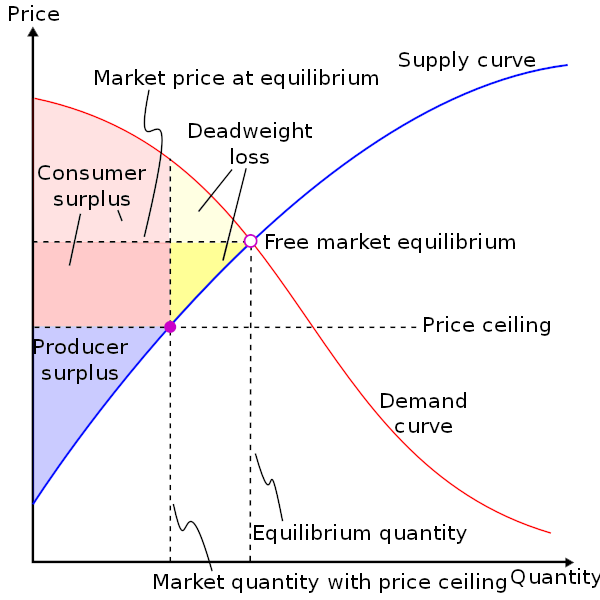
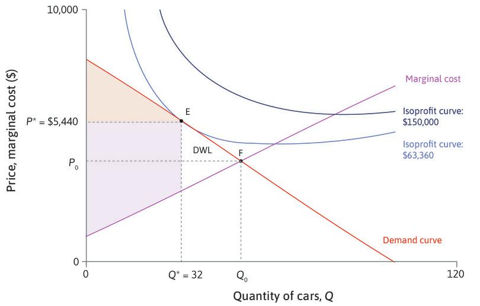

# Deadweight loss

The loss of [[surplus]] that occurs in [[supply-and-demand]] when the market quantity is less than the equilibrium quantity. In this case, there is a gap between the supply and demand, as there are consumers who are willing to buy but are unable to due to the reduced quantity, and there are producers who are willing to sell but are also unable to.

Deadweight loss is caused by a sub-equilibrium quantity but this can be caused by prices which are either above or below the equilibrium price. In the case of a price ceiling, the enforced price sits below the equilibrium. This means there is a shortage of supply because there are producers whose willingness to sell is above the price ceiling, so these producers will not sell at the ceiling and so the market quantity is reduced. Because there are consumers who would be willing to buy at a price above the ceiling, the market does not clear; demand exceeds supply. This creates a deadweight loss for the consumers, because consumers who would pay more than the equilibrium price are unable to, and so the [[surplus]] they would receive is eliminated. Likewise, there are also producers who would be willing to sell above the ceiling price but below the equilibrium price, so their surplus is also lost.

Deadweight loss can also arise in a monopoly situation where the only producer is attempting to maximise their profit. Because producer profit is maximised when producer surplus is at its maximum, and moving along the demand curve causes a reduction in the ratio of producer surplus to consumer surplus, there is a price above the equilibrium at which the producer can maximise their profit, where they produce a smaller quantity at a higher price.

In these situations, it is possible for the producer to first capture surplus at the reduced quantity and higher price, and then capture additional surplus closer to the equilibrium, by using [[price-discrimination]] or a sale. In the case of a sale, the producer first offers the good at the non-equilibrium price $P^*$ which maximises their profit, and then they have a sale at a lower price $P^S < P^*$. Assuming that all consumers whose willingness to pay is equal to or greater than the original price $P^*$ have already purchased the good before the sale started, this mean that the optimal producer surplus has already been captured.

[//begin]: # "Autogenerated link references for markdown compatibility"
[surplus]: surplus.md "surplus"
[supply-and-demand]: supply-and-demand.md "supply-and-demand"
[price-discrimination]: price-discrimination.md "price-discrimination"
[//end]: # "Autogenerated link references"