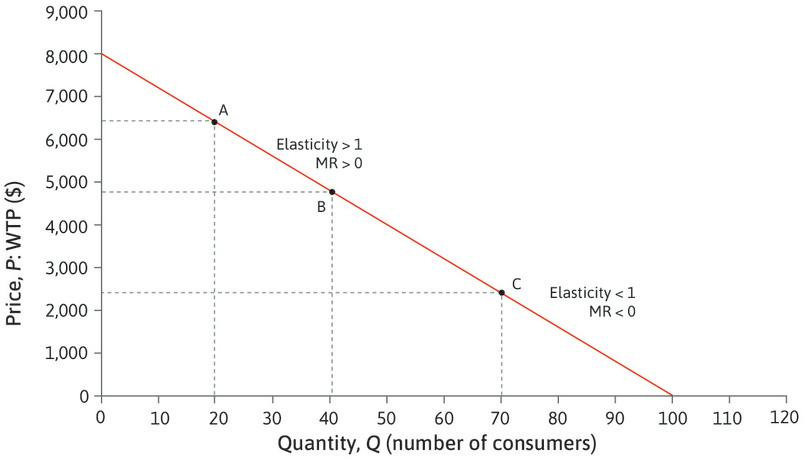

# Elasticity

A measure of the percentage change in one variable with respect to the percentage change in another variable. For example, one may talk about the price elasticity of demand [^1] (see [[supply-and-demand]]), which means the percentage change in quantity as a function of the percentage change in price. Algebraically, $E = \% \Delta q / \% \Delta p$. When we say "the X elasticity of Y", we are discussing how a change in X affects Y, not the other way around; the causal or independent variable is the first one mentioned.

It is important to note that because elasticity is a ratio of percentages, it is a function of both the derivative and current values of the variables under consideration, and so the elasticity changes when moving along a linear function.

When $E \gt 1$ we say the quantity is _elastic_, and when $E \lt 1$ we say the quantity is _inelastic_.

Elasticity has an effect on how increased prices from taxes affect consumers and producers (see [[tax-burden]]), and affects the [[deadweight-loss]] caused by, and profit margin of, suppliers in a monopoly.

[^1]: In the case of price elasticity of demand, we may simply say "the elasticity of demand", since demand is assumed to be a relationship between price and quantity, and so the dependent variable is implicit.

[//begin]: # "Autogenerated link references for markdown compatibility"
[supply-and-demand]: supply-and-demand.md "Supply and demand"
[tax-burden]: tax-burden.md "Tax burden"
[deadweight-loss]: deadweight-loss.md "Deadweight loss"
[//end]: # "Autogenerated link references"
