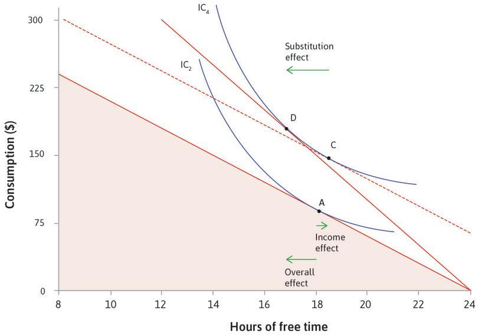

# Income and substitution effects

An income effect is the change in consumption that occurs due to a change in income. A substiution effect is the change in consumption that occurs due to a change in cost. In the context of wages, income and substitution effects explain why people may choose to work longer hours when receiving an increase in wage.

The income effect shows the effect of an increase in income (or consumption) for each number of hours worked, _without a corresponding change in opportunity cost_. This would be like receiving a basic income, so you are always X dollars richer, no matter how many hours you work. This would allow you to reach a higher indifference curve (total utility is higher) and you will choose to work less hours while still making more money.

The substitution effect captures how the change in opportunity cost affects this decision. At a higher wage rate, your time is now worth more, and so if you choose to work less, you are also taking on a higher [[opportunity-cost]] for working extra time. Thus in order to achieve the same level of utility as from the income effect alone, you need to work longer hours.

[//begin]: # "Autogenerated link references for markdown compatibility"
[opportunity-cost]: opportunity-cost.md "Opportunity cost"
[//end]: # "Autogenerated link references"
